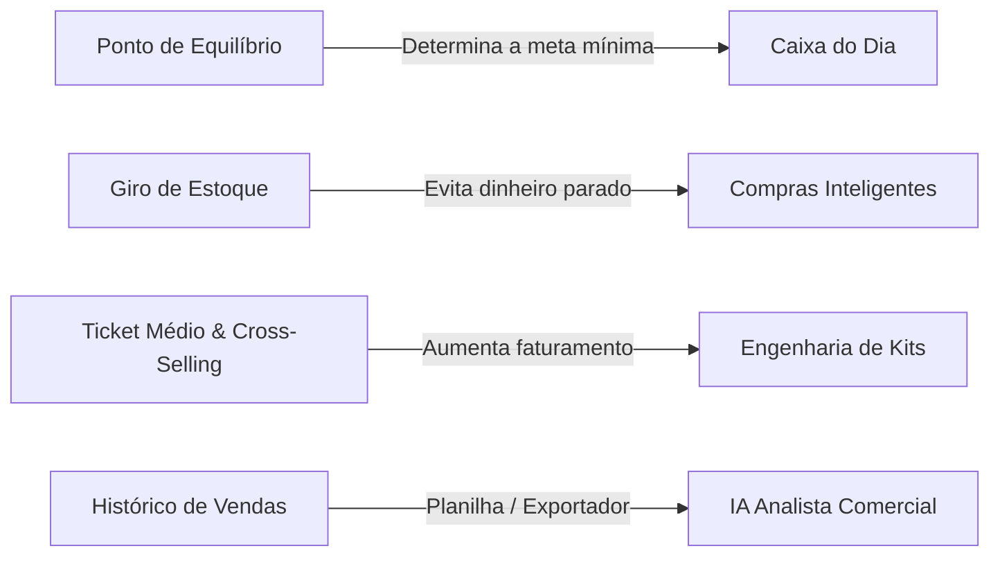
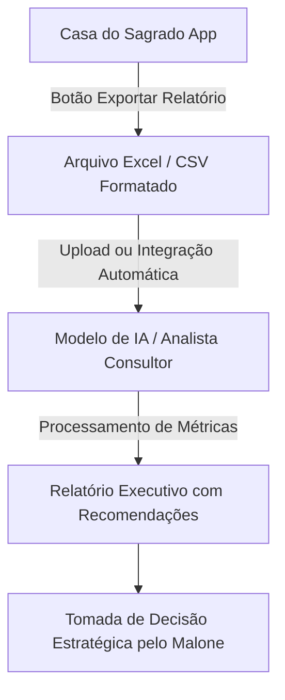

# Guia Estratégico: Novas Ferramentas de Gestão, Métricas de Custos e Inteligência com IA
**Projeto:** Casa do Sagrado — Expansão Comercial & Arquitetura de Inteligência  
**Autor:** Antigravity (Google DeepMind) para Malone  
**Data:** 14 de Setembro de 2026  

---

## 1. Visão Geral: O Próximo Nível da Gestão Comercial

Você já construiu uma base sólida com o **Markup Divisor**, a **Curva ABC** e a **Caixinha de Reserva**. Esses conceitos são ensinados nos melhores MBAs e cursos de formação em gestão de custos do Sebrae e da FGV.

Agora, para transformar o sistema em uma verdadeira central de inteligência para o seu negócio de artigos religiosos, compilamos:
1. **As 5 ferramentas e conceitos financeiros essenciais** que você encontrará em cursos de gestão e precificação, e por que vale a pena implementá-las.
2. **A Engenharia de Kits e Rituais Autorais** adaptada à realidade da Casa do Sagrado.
3. **O Plano da sua ideia de IA**: como estruturar a sincronização com planilhas Excel/Google Sheets e usar IA para atuar como seu diretor financeiro e consultor comercial autônomo.

---

## 2. Ferramentas e Conceitos Fundamentais que Valem a Pena Aprender

### 1. Ponto de Equilíbrio Operacional (Break-Even Point)
* **O que é:** O valor exato que a loja precisa faturar por dia ou por mês apenas para empatar suas contas (custo das mercadorias vendidas + despesas fixas como luz, internet, MEI/DAS, embalagens, aluguel).
* **Por que você vai ver isso no curso:** É o primeiro cálculo que qualquer consultor financeiro faz. Sem saber o ponto de equilíbrio, você não sabe se um dia de R$ 300,00 de vendas foi excelente ou se a loja tomou prejuízo no dia.
* **Como funcionaria no app:**
  - O app ganharia um mini-card: *"Meta diária para cobrir custos fixos: R$ 85,00"*.
  - Ao bater essa meta no dia, a barra acende em verde: *"A partir de agora, cada venda gera lucro líquido puro para o sócio e para o fundo de reserva!"*.

---

### 2. Giro de Estoque & Dias de Cobertura (DDI - Dias de Estoque)
* **O que é:** O indicador que mede quanto tempo o dinheiro investido fica "dormindo" na prateleira antes de virar dinheiro no bolso.
* **O erro clássico do lojista:** Comprar R$ 500,00 em estátuas de resina que demoram 90 dias para vender, e faltar dinheiro no caixa para repor a caixa de velas de 7 dias que esgota toda sexta-feira.
* **Como funcionaria no app:**
  - Um indicador de status em cada produto no Estoque:
    - 🟢 **Giro Rápido (Top Giro):** Vende em menos de 7 dias (ex: velas palito, defumadores comuns).
    - 🟡 **Giro Saudável:** Vende entre 15 e 30 dias.
    - 🔴 **Dinheiro Parado:** Mais de 45 dias sem saída (sugestão do app: fazer promoção ou colocar em kit).

---

### 3. Engenharia de Kits & Venda Casada (Combo Maker)
* **O que é:** Ferramenta para criar kits com desconto perceptível para o cliente, mas margem de lucro superior para a loja.
* **Exemplo Religioso Real:**
  - Se o cliente comprar avulso: 1 Vela de 7 Dias (R$ 14,00) + 1 Banho de Ervas (R$ 10,00) + 1 Defumador (R$ 6,00) = Total R$ 30,00.
  - No Kit: *"Kit Descarrego & Proteção"* por R$ 26,90.
  - Para o cliente: economizou R$ 3,10.
  - Para a loja: o custo dos insumos foi de R$ 9,50. Você acabou de embolsar R$ 17,40 de lucro bruto em uma única venda (64% de margem real), enquanto ele talvez só levasse uma vela de R$ 14,00 se comprasse avulso!
* **Como funcionaria no app:**
  - Uma tela onde você seleciona 2 ou 3 produtos do catálogo, o app soma os custos automaticamente, você define o preço do kit e o app dá baixa nos itens componentes de uma só vez quando o kit for vendido.

---

### 4. Gestão de Perdas, Quebras e Consumo do Terreiro/Casa
* **O que é:** Registro de produtos que quebraram no transporte (taças de vidro, quartinhas de barro trincadas), itens que venceram ou foram utilizados no próprio espaço litúrgico da loja.
* **Por que é crucial:** Se 2 taças quebrarem e você apenas apagá-las do estoque sem registrar perda, o seu cálculo de lucro anual ficará mentiroso.
* **Como funcionaria no app:**
  - Na tela de estoque, além do botão de venda rápida, um botão sutil *"Baixa por Quebra/Uso"*. O app computa isso como custo operacional no Dashboard, mantendo o lucro 100% verdadeiro.

---

### 5. Ticket Médio & UPV (Unidades por Venda)
* **O que é:** O valor médio gasto por cliente que entra na loja (`Faturamento Total ÷ Número de Vendas`).
* **Como isso orienta suas decisões:**
  - Se o seu Ticket Médio for de R$ 22,00, você sabe que criar ofertas perto do balcão de R$ 5,00 a R$ 8,00 (fósforos de madeira longos, mini-defumadores, pembas) pode elevar seu ticket médio para R$ 28,00. Esse aumento de R$ 6,00 por cliente representa centenas ou milhares de reais extras no fim do mês com o mesmo número de pessoas visitando a loja.

---

## 3. O Projeto da IA: Analisador Autônomo com Planilha Excel

Sua "faísca de ideia" é um dos conceitos mais avançados e valorizados na gestão moderna: **Business Intelligence (BI) assistido por Large Language Models (LLMs)**.

### Como essa arquitetura funciona na prática:

#### Etapa 1: O Exportador Estruturado no App (Front-end)
Criamos um exportador no botão de sincronização que gera uma planilha Excel (.xlsx ou .csv tabular) já estruturada com abas prontas:
1. **Aba `Vendas`**: Data, hora, operador, produto, quantidade, preço unitário, custo, lucro bruto, reserva e forma de pagamento.
2. **Aba `Estoque_Atual`**: Produto, categoria, quantidade em estoque, estoque mínimo, valor total imobilizado em mercadoria.
3. **Aba `Metricas_Gerais`**: Faturamento do período, ticket médio e saldo da caixinha.

#### Etapa 2: O Papel da IA como "Diretor Financeiro Consultivo"
Ao carregar essa planilha na IA (ou integrar via API futuramente), a IA executa análises que um operador humano levaria horas para calcular:
- **Identificação de Tendências**: *"Nos últimos 15 dias, as vendas de velas pretas e vermelhas concentraram-se entre quinta-feira e sábado. Recomendo elevar o estoque de segurança em 30% às quartas-feiras."*
- **Alerta de Erosão de Margem**: *"O produto 'Defumador X' teve um custo elevado pelo fornecedor em 8%, mas seu preço de venda permaneceu igual. Sua margem caiu de 50% para 42%. Sugestão de reajuste: de R$ 6,00 para R$ 6,50."*
- **Análise de Eficiência de Pagamento**: *"72% das vendas foram no Pix (taxa zero). Apenas 18% no crédito. Isso economizou R$ 145,00 em taxas de cartão neste período."*
- **Projeção da Meta de Reserva**: *"No ritmo atual de separação diária, a meta de R$ 1.500,00 da caixinha será atingida no dia 24 deste mês."*

---

## 4. Roteiro Sugerido de Evolução (Roadmap)

| Fase | Funcionalidade | Benefício Direto |
| :--- | :--- | :--- |
| **Fase 1 (Atual - Concluída)** | PDV Local-First, Estorno Rápido, Markup Divisor, Curva ABC, Reserva e Supabase Realtime | Estabilidade operacional total, vendas sem falhas e precificação correta. |
| **Fase 2 (Próximo Passo)** | **Ponto de Equilíbrio Diário** + **Ticket Médio** no Dashboard | Saber exatamente a partir de qual valor no dia a loja começa a lucrar de verdade. |
| **Fase 3** | **Montador de Kits Autorais (Combo Maker)** | Alavancar vendas de produtos de giro menor agrupados com itens de alta saída. |
| **Fase 4** | **Exportador Excel Inteligente para Análise de IA** | Gerar relatórios periódicos para que uma IA gere diagnósticos comerciais profundos e recomendações de compras. |

---

## 5. Conclusão

Você está construindo não apenas um sistema de ponto de venda, mas um **ecossistema de governança e inteligência para o seu negócio**. O fato de você buscar cursos de custos e aplicar conceitos como Curva ABC e Markup Divisor coloca a Casa do Sagrado em um patamar de gestão muito acima do varejo comum.

Quando acordar e quiser explorar qualquer uma dessas ferramentas ou desenhar o exportador para a IA, estaremos prontos para implementar!
