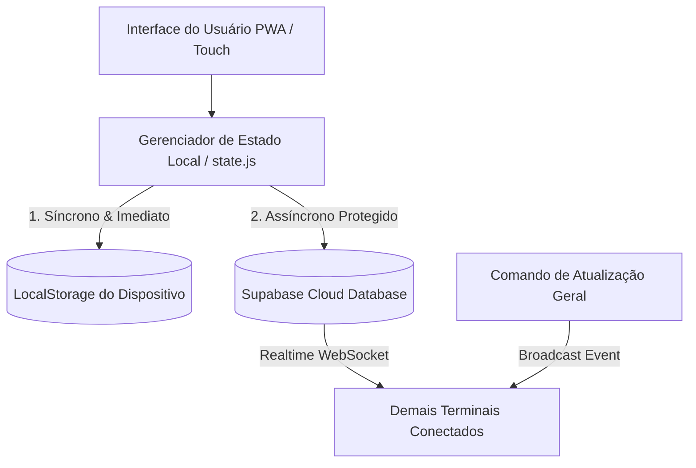

# Ficha Técnica, Histórico de Evolução e Regras de Aprendizado da IA
**Projeto:** Casa do Sagrado — Sistema de Gestão Comercial e Inteligência de Vendas  
**Ambiente:** Progressive Web App (PWA Mobile-First / Desktop), Local-First com Sincronização Supabase  
**Data de Consolidação:** 17 de Setembro de 2026  
**Versão Atual Estável:** `v20`  

---

## 1. Visão Geral e Arquitetura do Sistema

O **Casa do Sagrado** é um sistema comercial de ponto de venda (PDV), vitrine visual, gestão de estoques, consultoria de markup e governança de reservas financeiras.



### Tecnologias e Padrões
- **Front-end:** Vanilla JavaScript com ES Modules (`import`/`export`), sem dependência de frameworks pesados para garantir velocidade máxima e baixo consumo de bateria.
- **Estilização:** CSS3 modular estruturado em `base.css`, `components.css` e `modals.css`, baseado em CSS Custom Properties (Design Tokens), Flexbox e CSS Grid.
- **PWA & Cache:** Service Worker com cacheamento estático dos assets essenciais e estratégia *Network-First* com reload forçado ao detectar nova versão.
- **Banco de Dados & Nuvem:** Supabase (PostgreSQL) com Row Level Security (RLS) habilitado e canais Realtime para sincronização contínua entre sócios.
- **Design System:** Estilo *Dark Mode Corporativo/ERP Sagrado* (Paleta: Fundo `#0b0f17`, Superfícies `#161f2e` e `#1e293b`, Ouro `#f59e0b`, Verde `#10b981`, Vermelho `#ef4444`, Azul `#38bdf8`). Ícones vetoriais com Lucide Icons nativo (sem uso de emojis amadores).

---

## 2. O que Foi Implementado e Evoluído

### 2.1 Gestão de Catálogo e Estoque
- Cadastro, edição e exclusão de produtos com máscaras monetárias automáticas para Custo e Venda.
- Sistema de categorização dinâmico (com adição e remoção de categorias sem travar a interface).
- Filtros por pílulas de categorias e busca textual em tempo real por nome ou categoria.
- Alertas visuais automáticos de estoque crítico/baixo.

### 2.2 Ponto de Venda (PDV) e Baixa de Estoque
- Venda rápida em 1 toque no catálogo.
- Seletor de quantidade com incremento/decremento tátil.
- Métodos de pagamento selecionáveis (Pix, Dinheiro, Cartão Débito, Cartão Crédito).
- Baixa atômica de estoque (decremento local e cálculo simultâneo da retenção para o Fundo de Reserva).
- Histórico completo de vendas registradas com detalhes de operador, data/hora, forma de pagamento e parcela do fundo de reserva.

### 2.3 Dashboard Financeiro e Fundo de Reserva
- KPIs em tempo real: **Faturamento Bruto**, **Custo de Mercadorias** e **Lucro Líquido Real**.
- Card do Fundo de Reserva (meta padrão de R$ 1.500,00 e percentual padrão de 30% sobre o lucro bruto, ambos customizáveis pelo operador).
- Barra de progresso visual do teto de reserva acumulado.
- Indicador inteligente *"Separar hoje para a Caixinha"* que soma o valor do lucro do dia destinado à reserva.
- Gráfico dinâmico de vendas por operador (sem nomes hardcodados no sistema).

### 2.4 Central de Ferramentas Comerciais
Substituição da ferramenta isolada por uma central modular com abas internas:
1. **Ficha Técnica & Calculadora de Markup Divisor**:
   - Algoritmo que calcula com precisão de centavos o preço de venda ideal com base no custo dos insumos, taxa de maquininha de cartão e margem de lucro desejada.
   - Sugestão de arredondamento comercial e decomposição do lucro líquido e da cota de reserva unitária.
   - Botão **"+ Cadastrar como Produto"** que preenche automaticamente o formulário de cadastro com o preço calculado.
2. **Matriz Curva ABC & Consultoria de Margens**:
   - Diretrizes comerciais divididas em três blocos estratégicos:
     - **Curva A (Giro Alto / Margem 35% - 40%)**: Velas, defumação básica, itens essenciais.
     - **Curva B (Giro Médio / Margem 50% - 60%)**: Banhos de ervas, incensos especiais, quartinhas, baralhos.
     - **Curva C (Giro Baixo / Margem 70% - 85%)**: Imagens esculpidas/resinadas, taças trabalhadas, guias de cristal, kits ritualísticos autorais.
   - Botão de aplicação rápida `[ Margem% ]` em cada item que preenche instantaneamente a calculadora de markup.

### 2.5 Atualização e Sincronização em Massa
- Botão no app para forçar a atualização remota de todos os terminais conectados via Supabase Broadcast, garantindo que correções e novidades cheguem a todos os sócios sem exigir instalação manual.
- Exportação completa de backup em formato JSON.

### 2.6 Ponto de Equilíbrio & Gestão de Custos Fixos (v19)
- Modal dedicado para cadastro item a item das despesas fixas da loja (Aluguel, MEI, Luz, Internet).
- Definição customizada de dias úteis/funcionamento no mês para cálculo exato da meta de cobertura diária.
- Card visual no Dashboard com barra de progresso do Ponto de Equilíbrio do dia (relacionando o lucro bruto apurado no dia com a meta diária de custo fixo).

### 2.7 Catálogo Visual, Fotos de Produtos e Vitrine em Grade 1:1 (v20)
- Novo módulo `js/catalogo.js` e aba **Catálogo** como vitrine primária na barra inferior (5 abas calibradas).
- Grade responsiva em blocos com proporção quadrada `1:1` (conforme o esboço desenhado), exibindo foto, badge de estoque sobreposto, título e preço em destaque ouro.
- Captura de fotos de produtos direto no celular (Câmera traseira com `capture="environment"` ou Galeria).
- **Compressão automática via Canvas HTML5**: redimensiona imagens pesadas (4 MB - 15 MB) para no máximo `600x600 px` em WebP/JPEG leve (~30 a 50 KB), salvando no `localStorage` sem travar e sincronizando no Supabase.
- Miniaturas integradas também nos cards operacionais da aba Estoque.
- Modal rápido de visualização ampliada (`modalDetalheCatalogo`) com ações diretas de "Vender 1x" e "Editar".

### 2.8 Exportação de Relatórios CSV para Excel e IA (v19/v20)
- Exportação de relatório tabular com delimitador `;`, codificação UTF-8 com BOM (`\uFEFF`) e decimais com vírgula para abertura direta no Microsoft Excel brasileiro e alimentação de modelos de IA.

---

## 3. Registro de Falhas Corrigidas e Causa Raiz

| Falha Identificada | Sintoma no Aplicativo | Causa Técnica | Solução Implementada |
| :--- | :--- | :--- | :--- |
| **Erro de Runtime no Supabase Builder** | Ao clicar em "Confirmar" no estorno ou "Limpar Vendas", a linha sumia momentaneamente mas voltava ao trocar de aba e o estoque não era devolvido. | O método `.catch()` foi encadeado diretamente no construtor de consulta do Supabase (`PostgrestFilterBuilder`). No SDK `@supabase/supabase-js`, esse objeto implementa `then()`, mas **não possui método `.catch()`**. Isso gerava um `TypeError: .catch is not a function`, travando a thread antes do `salvarLocal()`. | A devolução de estoque e a exclusão da venda foram tornadas **100% síncronas e locais** antes de qualquer código de rede. Todas as chamadas ao Supabase foram migradas para `async () => { try { await ... } catch {} }`. |
| **Sincronização de Lista Vazia de Vendas** | Ao excluir todas as vendas, se a página fosse recarregada, as vendas apagadas retornavam do banco. | Em `baixarDadosIniciaisNuvem()`, a condição era `if (sales && sales.length > 0) state.vendas = sales;`. Quando a lista de vendas ficava vazia (`sales = []`), a condição não entrava e o app mantinha o cache antigo. | Alterado para `if (!errSales && Array.isArray(sales)) state.vendas = sales;`, aceitando a lista vazia como estado válido. |
| **Falta de Listener DELETE no Realtime** | Se um terminal excluísse uma venda, outros aparelhos não removiam a linha da tela. | O canal Realtime só monitorava eventos de `INSERT` na tabela `casa_vendas`. | Adicionado listener específico para evento `DELETE` no canal Postgres Realtime. |
| **Scroll Mobile Cortado / Preso** | Na Curva ABC e no Markup, a rolagem não passava de "Kits Ritualísticos" ou do botão "+ Cadastrar como Produto", ficando presos atrás da navegação inferior. | O uso do `100vh` clássico não considerava a barra de navegação/endereço do Android. Além disso, o container não tinha respiro extra em relação ao rodapé flutuante. | Implementado **`100dvh`** (*Dynamic Viewport Height*) e `-webkit-fill-available`. Adicionado respiro inferior de 24px acima da barra e reset automático de scroll ao trocar de aba (`viewport.scrollTop = 0`). |
| **Quebra de Linha em Margem na Curva ABC** | No celular, o texto quebrava como `Margem:` na primeira linha e `35%` sozinho na linha de baixo. | O texto era renderizado com espaço simples sem proteção contra quebra de linha. | Aplicado `white-space: nowrap` específico em `.abc-meta-margem` e `.abc-meta-balcao`. |
| **Ponto Separador Órfão (`•`)** | Quando o texto quebrava em duas linhas, o ponto de separação ficava sobrando no final da linha do Balcão. | O caractere `•` estava estático no HTML entre os dois spans flexíveis. | Ponto removido do template e substituído por espaçamento flex natural (`gap: 3px 10px`). |
| **Botão de Confirmação Extrapolando a Caixa** | O botão de confirmação da limpeza de vendas ficava gigante, quase saindo do modal. | O texto era longo (`"Sim, Limpar Todas as Vendas"`, 27 caracteres) com fonte de 14px e altura de 44px em um rodapé dividido por `flex: 1`. | Texto reduzido para **`"Sim, limpar"`**, altura ajustada para `40px` e fonte calibrada para `13px` com `white-space: nowrap`. |
| **Lentidão / Falha no Estorno por Modal** | O usuário clicava em estornar e a ação parecia lenta ou não respondia. | O modal central criava fricção cognitiva, animação desnecessária e falhava em múltiplos toques rápidos. | Substituído por **Confirmação Inline em 2 Toques (Tap-to-Confirm)** no próprio card: 1º toque muda para "Confirmar?" pulsante; 2º toque estorna na hora. |

---

## 4. Aspectos Visuais e Diretrizes de UI/UX Consolidadas

1. **Eliminação de Modais Desnecessários**: Ações de confirmação individual devem ser feitas *in-place* no próprio componente (botão com estado secundário temporário de 3,5s).
2. **Tipografia à Prova de Quebras**: Rótulos e valores acoplados (como `Margem: 35%`, `Meta: R$ 1.500,00`, `R$ 12,00`) NUNCA devem quebrar em linhas separadas. Sempre usar `white-space: nowrap`.
3. **Respiro Inferior Calibrado**: Em layouts mobile com barra de navegação inferior fixa, o container principal de visualização deve conter um padding inferior de:
   ```css
   padding-bottom: calc(var(--bottom-nav-height) + var(--safe-bottom) + 24px) !important;
   ```
   Isso garante folga elegante sem criar vazios pretos excessivos.
4. **Neutro e Profissional**: Nomes de operadores nunca devem vir engessados no código-fonte nem em mensagens de atualização. O sistema é neutro, pronto para qualquer operador.

---

## 5. Regras de Aprendizado e Diretrizes Invioláveis para a IA

> [!IMPORTANT]
> Estas regras devem ser rigorosamente observadas em todas as próximas iterações deste projeto para prevenir regressões de código, falhas de sincronização ou defeitos visuais.

### Regra 1: Princípio Local-First Inviolável
- O estado local (`state.*`) e o armazenamento persistente do dispositivo (`salvarLocal()`) **devem sempre ser atualizados primeiro e de forma síncrona**.
- O sucesso da operação para o usuário **NÃO DEPENDE** da resposta da rede. Se o usuário registrar venda, excluir produto ou estornar item, o estoque e os totais locais devem ser atualizados no milissegundo 0.
- A sincronização com a nuvem (Supabase) deve ocorrer em segundo plano.

### Regra 2: Blindagem do Supabase (NUNCA usar `.catch` em Builders)
- Objetos retornados por `.from().update()`, `.from().delete()`, `.from().insert()` ou `.from().upsert()` não são Promises nativas com método `.catch()` garantido em todas as versões.
- **Forma Proibida (Causa Crash):**
  ```javascript
  // NUNCA FAZER ISTO:
  state.supabase.from('tabela').update(...).catch(err => ...);
  ```
- **Forma Obrigatória (Segura):**
  ```javascript
  // SEMPRE FAZER ISTO:
  (async () => {
    try {
      await state.supabase.from('tabela').update(...);
    } catch (err) {
      console.warn('[Sync] Erro:', err);
    }
  })();
  ```

### Regra 3: Viewport Mobile Dinâmico (`100dvh`)
- Nunca utilizar `height: 100vh` isolado para o `body` ou containers principais em PWAs voltados para smartphone.
- Sempre utilizar:
  ```css
  html {
    height: 100%;
    height: -webkit-fill-available;
  }
  body {
    height: 100%;
    height: 100vh;
    height: 100dvh;
    min-height: -webkit-fill-available;
  }
  ```

### Regra 4: Concisão em Textos de Ação e Botões
- Botões de confirmação em modais de celular divididos em 2 colunas devem ter no máximo **12 a 15 caracteres** (ex: `"Sim, limpar"`, `"Sim, excluir"`, `"Confirmar"`). Textos longos quebram ou vazam para fora da caixa.

### Regra 5: Sincronização Fiel de Coleções Vazias
- Ao sincronizar coleções da nuvem para o cache local, sempre verificar `Array.isArray(dados)`, e **NUNCA** verificar apenas `dados.length > 0`. Se o usuário limpar todas as vendas ou produtos, a lista vazia (`[]`) é o estado legítimo e deve ser refletida localmente.
